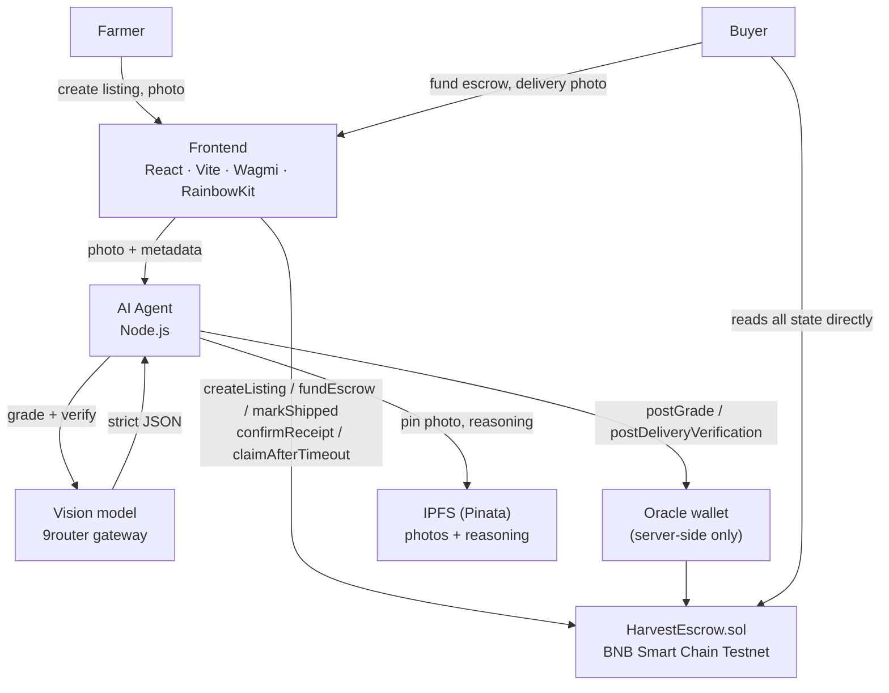

# VeriPanen

Harvest quality, recorded on-chain. **Indonesia Web3 Hackathon 2026 · Track 1 — AI Agents · BNB Smart Chain Testnet.**

---

## The problem

A grower knows their harvest is good. The buyer has no way to confirm that independently.
Quality assessment is informal, inconsistent, or mediated by whoever holds the leverage. By the
time goods arrive and a dispute starts, there is no shared reference to argue from.

## The solution

VeriPanen photographs the harvest, has an AI agent grade it against fixed visual criteria, and
writes that grade — plus its confidence — to BNB Chain before any money moves. When the buyer
receives the goods, a second AI pass compares what arrived against the originally graded photo.
Escrow follows that comparison: match releases payment, mismatch locks it and opens a dispute.

## Why blockchain

Not to make the AI correct. To make the *record* of what the AI decided permanent and readable by
anyone. Once a grade is posted it cannot be quietly rewritten — not by the farmer, not by the
buyer, not by the oracle wallet, not by the contract owner. The timestamp, the value, and the
oracle address that submitted it stay visible forever.

## Why AI

A photograph is the only evidence most smallholders can produce cheaply. An automated inspector
turns that photograph into a comparable signal with an explicit confidence value, in seconds, at
near-zero marginal cost. It is a standardized assessment, not an authority.

> **The distinction that matters:** AI provides a standardized automated assessment. The on-chain
> record makes that result independently auditable. It does **not** guarantee the AI is right.

## Architecture

The smart contract never calls an AI API. An off-chain agent does the thinking; a dedicated oracle
wallet is the only address permitted to write results on-chain.



### Two-stage verification (non-negotiable)

**Stage 1 — initial grading.** Farmer creates a listing with crop type, weight, price, a photo
hash, and a photo URI. The agent grades the photo and returns
`{ grade: "A"|"B"|"C", confidence: 0-100, reasons: [] }`. The oracle posts it. The grade is now
immutable.

**Stage 2 — delivery verification.** Buyer funds escrow. Farmer marks shipped, which starts a
7-day deadline. Buyer uploads a photo of what arrived. The agent compares it against the original
photo and locked grade, returning `{ matched: bool, confidence: 0-100, differences: [] }`. Escrow
follows: match → payment to farmer; mismatch → `Disputed`, funds locked; buyer silent → farmer
claims after the deadline.

The two calls are separate functions, separate prompts, and separate on-chain transactions. They
are never collapsed into one.

## Tech stack

| Layer | Choice |
| --- | --- |
| Contract | Solidity 0.8.28, Foundry, OpenZeppelin `ReentrancyGuard` |
| Chain | BNB Smart Chain Testnet (chain id 97, tBNB) |
| Agent | Node.js, Viem, OpenAI-compatible gateway client |
| AI | Vision model via 9router gateway, strict JSON output |
| Storage | IPFS via Pinata (hash always on-chain) |
| Frontend | React 19, Vite, Wagmi v2, RainbowKit, Viem, Tailwind v4, Motion |

## Repository structure

```
veripanen/
├── contract/            Foundry project — HarvestEscrow.sol + tests
│   ├── src/HarvestEscrow.sol
│   ├── test/HarvestEscrow.t.sol
│   ├── script/Deploy.s.sol
│   └── foundry.toml
├── agent/               Off-chain AI agent + HTTP API
│   ├── src/
│   │   ├── grading/     Stage 1
│   │   ├── delivery/    Stage 2
│   │   ├── ai/          gateway client, JSON validation, retries
│   │   ├── blockchain/  oracle wallet, contract writes
│   │   ├── ipfs/        Pinata upload, MIME sniffing
│   │   ├── validation/  input sanitization
│   │   ├── logs/        JSONL audit log
│   │   ├── flows.js     end-to-end orchestration
│   │   ├── server.js    HTTP API for the frontend
│   │   └── cli.js       manual testing
│   └── .env.example
├── frontend/            React app — Farmer, Buyer, Public ledger
│   ├── src/pages/       FarmerPage, BuyerPage, PublicPage, ListingDetailPage
│   ├── src/components/  shell, ui primitives, per-role panels
│   ├── src/hooks/       contract reads
│   ├── src/lib/         ABI, formatting, agent client
│   └── .env.example
└── README.md
```

## Local setup

### 0. Prerequisites

- [Foundry](https://book.getfoundry.sh/getting-started/installation) (`forge`, `cast`, `anvil`)
- Node.js 20+
- A wallet with BNB Testnet tBNB from the [faucet](https://www.bnbchain.org/en/testnet-faucet)

### 1. Contract

```bash
cd contract
forge install            # forge-std + openzeppelin (already vendored in lib/)
cp .env.example .env     # fill PRIVATE_KEY, ORACLE_ADDRESS, BNB_TESTNET_RPC_URL
forge build
forge test
```

### 2. Deploy to BNB Testnet

```bash
cd contract
source .env
forge script script/Deploy.s.sol \
  --rpc-url "$BNB_TESTNET_RPC_URL" \
  --broadcast \
  --verify
```

Record the printed contract address. Put it into both `.env` files below.

### 3. Agent

```bash
cd agent
npm install
cp .env.example .env
```

Fill in:

| Variable | Meaning |
| --- | --- |
| `GLM_BASE_URL` | OpenAI-compatible gateway base URL, ends with `/v1` |
| `GLM_API_KEY` | Gateway API key |
| `GLM_MODELS` | Comma-separated model list (rotated when one is unavailable) |
| `ORACLE_PRIVATE_KEY` | Oracle wallet key — **server-side only, never in the frontend** |
| `CONTRACT_ADDRESS` | Deployed escrow address |
| `BNB_TESTNET_RPC_URL` | RPC endpoint |
| `PINATA_JWT` | Pinata token for real IPFS pinning |
| `MIN_CONFIDENCE` | Reject-and-log threshold (default 70) |

> **AI provider note.** The `GLM_*` variable names are historical. They point at the
> **9router gateway** (`GLM_BASE_URL=https://api.thirtystore.com/v1`), and the models are named
> with the `thirty/` prefix, e.g. `thirty/deepseek-v4-flash`. To change the model, edit `GLM_MODELS`;
> the on-chain verification logic does not change, because the smart contract never calls the AI
> directly — it only trusts the configured oracle address to report the result.

```bash
npm start          # HTTP API on :8787
npm test           # validation unit tests
node src/cli.js oracle                                  # print oracle address
node src/cli.js grade --id 1 --crop Rice --weight 100 --photo ./rice.jpg
node src/cli.js verify --id 1 --delivery ./delivered.jpg
```

### 4. Frontend

```bash
cd frontend
npm install
cp .env.example .env    # fill VITE_CONTRACT_ADDRESS, VITE_AGENT_URL
npm run dev             # http://localhost:5173
```

## Environment variables

Never commit `.env`. Every `.env` is covered by `.gitignore`; only `.env.example` is tracked. Copy
each example and fill it in locally:

- `contract/.env` — `PRIVATE_KEY`, `ORACLE_ADDRESS`, `BNB_TESTNET_RPC_URL`, and optionally
  `OPBNB_TESTNET_RPC_URL`.
- `agent/.env` — `GLM_API_KEY`, `ORACLE_PRIVATE_KEY`, `CONTRACT_ADDRESS`, `BNB_TESTNET_RPC_URL`,
  `MIN_CONFIDENCE`, and `PINATA_JWT`.
- `frontend/.env` — `VITE_CONTRACT_ADDRESS`, `VITE_BNB_TESTNET_RPC_URL`, `VITE_AGENT_URL`, and
  `VITE_WALLETCONNECT_PROJECT_ID`.

### WalletConnect

`VITE_WALLETCONNECT_PROJECT_ID` comes from [WalletConnect Cloud](https://cloud.reown.com): create a
project, copy its project id. It is only needed for the WalletConnect QR option — injected wallets
(MetaMask, Bitget) work without it. Never guess or reuse someone else's project id.

### Pinata

`PINATA_JWT` is required for IPFS upload through Pinata. Without it the agent falls back to inline
data URLs (fine for local demos, not for production). Create a JWT in the Pinata dashboard. Never
commit it.

### Oracle key boundary

```
Frontend  ──user/farmer/buyer transaction──>  HarvestEscrow
Agent server ──ORACLE_PRIVATE_KEY──> postGrade / postDeliveryVerification ──> HarvestEscrow
```

The frontend never holds or signs with the oracle private key. Only the agent's server-side
environment has it.

### Rotate before submission

If these credentials were exposed during development, rotate them before submission:

- deployer private key (`contract/.env` `PRIVATE_KEY`)
- oracle private key (`agent/.env` `ORACLE_PRIVATE_KEY` and `contract/.env` `ORACLE_ADDRESS`)
- `PINATA_JWT`
- `GLM_API_KEY`

The Anvil default keys in `agent/scripts/demo.js` are public, worthless, local-only test keys.

## Contract address

```
Network:      BNB Smart Chain Testnet
Chain ID:     97
Contract:     <filled in after deployment>
Oracle:       <filled in after deployment>
Deployment TX:<filled in after deployment>
```

## The complete user flow

1. Farmer connects a wallet and opens **Farmer**.
2. Farmer attaches a harvest photo, enters crop / weight / price, publishes.
   - The photo is hashed client-side and pinned to IPFS.
   - `createListing` writes crop, weight, price, hash, URI on-chain.
3. The agent grades the photo and, if confidence ≥ `MIN_CONFIDENCE`, the oracle calls `postGrade`.
   - Below threshold the agent writes a `MANUAL_REVIEW` log and posts nothing.
4. Buyer opens **Buyer**, sees the graded listing with its photo, grade, and confidence, and
   funds the escrow for the exact price. `fundEscrow`.
5. Farmer marks the shipment. `markShipped` starts a 7-day deadline.
6. Buyer uploads a photo of the received goods.
7. The agent compares it against the original photo and locked grade.
   - Match → `postDeliveryVerification(true)` → payment released to the farmer.
   - Mismatch → `postDeliveryVerification(false)` → `Disputed`, funds locked.
8. If the buyer simply disappears, the farmer calls `claimAfterTimeout` once the deadline passes.
9. Anyone, without a wallet, opens **Public ledger** and inspects every listing, every grade,
   every verification, and the full event timeline — read straight from the chain.

## Verified end-to-end (local chain)

Every scenario below was run against a real contract with real transactions. The script is
`agent/scripts/demo.js`; the machine-readable output is written to `agent/evidence/anvil-demo.json`.

```bash
# terminal 1
anvil

# terminal 2
cd contract && forge script script/Deploy.s.sol \
  --rpc-url http://127.0.0.1:8545 --broadcast

# terminal 3
cd agent && node scripts/demo.js
```

| Scenario | Result |
| --- | --- |
| Happy path: create → grade → fund → ship → verify matched | `Completed`, farmer paid, escrow back to 0 |
| Mismatch: received goods differ | `Disputed`, escrow stays locked, owner can resolve |
| Timeout: buyer goes quiet, deadline passes | early claim reverts, post-deadline claim pays the farmer |
| Unauthorized: farmer / buyer / outsider call `postGrade` | all revert (`NotOracle`), the real oracle still succeeds |

The AI stages were exercised with the live model as well:

| Step | Model output | On-chain |
| --- | --- | --- |
| Stage 1 grading | `grade C, confidence 25%, 4 reasons` | `postGrade` confirmed |
| Stage 2 verification | `matched true, confidence 90%, no differences` | `postDeliveryVerification` confirmed, listing `Completed` |

## Security considerations

- **Oracle-gated writes.** Only the configured oracle address can post grades or verifications.
  The owner cannot forge AI results — only replace the oracle itself.
- **Grade immutability.** `postGrade` requires `Created`; once posted the status becomes `Graded`
  and no second grade can overwrite it.
- **Checks-effects-interactions + `nonReentrant`.** Every function that transfers value updates
  state before the external call and is guarded against reentrancy.
- **Double-spend protection.** `Completed` and `Disputed` block every release path. Tested.
- **Strict state machine.** Each function asserts its required status with custom errors.
- **Prompt-injection mitigation.** System prompts are fixed and contain no user data. Crop type,
  filenames, and notes are sanitized (control characters, bidi overrides, length) and placed inside
  an explicitly delimited untrusted-metadata block. Model output is validated against a strict
  schema before anything is posted.
- **Low-confidence refusal.** Below `MIN_CONFIDENCE` the agent declines to make an on-chain
  decision and logs the case for manual review.
- **No secrets client-side.** The oracle key never leaves the agent process.
- **Input validation at boundaries.** Photo MIME is sniffed from magic bytes; the AI gateway
  rejects mismatched declared types, so this is enforced, not assumed.

## Known limitations

- **AI grading depends on image quality.** A blurry or badly lit photo yields a poor grade and low
  confidence.
- **The AI can misclassify harvest quality.** It is a standardized visual assessment, not a
  laboratory test and not a legally certified grading standard.
- **The oracle is a trust assumption.** A compromised oracle key could post false results. The
  contract limits this to "results from the trusted address," nothing more.
- **Dispute resolution is owner-controlled** in this MVP. There is no decentralized arbitration.
- **Testnet tBNB carries no economic value.** Nothing here is financial advice or a real market.
- **The system does not replace physical logistics verification.** It records a visual comparison.
- **The AI gateway is intermittently unavailable.** The agent rotates across a model list and
  retries with backoff, but a full gateway outage will pause grading until it recovers.
- **Frontend dependency advisories.** `npm audit` reports transitive findings in the
  WalletConnect / MetaMask SDK chain. They are not fixable without downgrading RainbowKit, which
  would break the required EVM wallet connection.

## Hackathon alignment

Track 1 asks for an AI agent doing real work, not a chatbot. The agent here receives a concrete
task, inspects an image, reasons about it against fixed criteria, produces structured output,
validates that output, and then acts on-chain through a dedicated oracle wallet as a participant in
the transaction workflow. The two-stage verification is the product, and it cannot be reduced to a
single prompt-and-answer.

## Troubleshooting

Every browser write runs through one preflight (`frontend/src/lib/txGuard.js`): it re-reads the live
account and chain from the wallet provider, blocks the transaction on a wrong chain or missing
account, and maps nonce/RPC failures to an actionable message.

### MetaMask nonce / RPC error after restarting Anvil

Anvil resets its local chain state when restarted, while wallet state may still contain transaction
history from the previous local chain session. If a nonce-related error appears:

1. Confirm MetaMask is connected to the expected local/test network.
2. Confirm the active account is the intended account.
3. Reset the wallet's local activity/nonce data using MetaMask's current developer/reset tools.
4. Reconnect the wallet.
5. Try the transaction again.

The app shows the same guidance inline when it detects `nonce too low`, `nonce too high`, or
`replacement transaction underpriced`. Do not use these steps on a mainnet account.

### "Invalid parameters were provided to the RPC method"

This generic MetaMask message almost always means the wallet is on the wrong chain. Confirm both the
app and the wallet point at the same network (local Anvil `31337`, or BNB Testnet `97`), then retry.

## License

MIT
