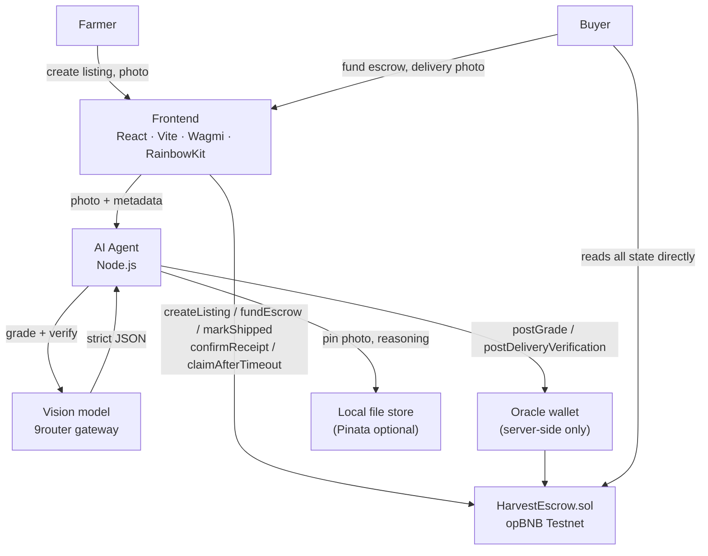

# VeriPanen — Submission

## Project

- **Team name:** Fhin Group
- **Project name:** VeriPanen
- **Track:** Indonesia Web3 Hackathon 2026 · Track 1 — AI Agents

## Network

- **Network:** opBNB Testnet
- **Chain ID:** 5611
- **Contract address:** `0xE07e56Af882368bc604F047Ed092A0C139c72809`
- **Explorer:** https://opbnb-testnet.bscscan.com/address/0xE07e56Af882368bc604F047Ed092A0C139c72809

Alternative target if needed: BNB Smart Chain Testnet, chain ID 97,
explorer https://testnet.bscscan.com.

> The contract is also verified on a local Anvil chain (chain ID 31337) at
> `0x5FbDB2315678afecb367f032d93F642f64180aa3` for development. That is a local chain, not a
> public testnet. The public deployment is the opBNB Testnet address above.

## Problem Statement

A grower knows their harvest is good. The buyer has no way to confirm that independently. Quality
assessment is informal, inconsistent, or mediated by whoever holds the leverage. By the time goods
arrive and a dispute starts, there is no shared reference to argue from.

## Solution

VeriPanen photographs the harvest, has an AI agent grade it against fixed visual criteria, and writes
that grade — plus its confidence — to BNB Chain before any money moves. When the buyer receives the
goods, a second AI pass compares what arrived against the originally graded photo. Escrow follows
that comparison: match releases payment, mismatch locks it and opens a dispute.

## Project Detail

### Architecture

### AI role

An off-chain Node.js agent performs two independent vision tasks:

- **Stage 1 — harvest grading.** Returns `{ grade: "A"|"B"|"C", confidence: 0-100, reasons: [] }`
  against fixed visual criteria.
- **Stage 2 — delivery verification.** Compares the original graded photo against the buyer's
  received-goods photo, returning `{ matched: bool, confidence: 0-100, differences: [] }`.

Both tasks use a fixed system prompt with user data isolated in an explicit untrusted block
(prompt-injection defense), and both enforce `MIN_CONFIDENCE` (default 70). Below the threshold the
agent returns `MANUAL_REVIEW` and **writes nothing on-chain**.

### Oracle role

The smart contract never calls AI. A single trusted oracle address reports results on-chain via
`postGrade` and `postDeliveryVerification`, both gated by `onlyOracle`. The oracle private key lives
only in the agent's server-side environment — never in the frontend bundle.

### Escrow flow

`Created → Graded → Funded → Shipped → Completed | Disputed`

- Farmer creates a listing (crop, weight, price, photo hash, photo URI).
- Agent grades; oracle posts the grade on-chain.
- Buyer funds escrow with the exact price.
- Farmer marks shipped; a 7-day deadline starts.
- Buyer uploads a delivery photo; agent verifies; oracle posts the result.
  - match → payment released to farmer (`Completed`)
  - mismatch → funds locked (`Disputed`)
- Buyer can confirm receipt directly; farmer can claim after the deadline; owner resolves disputes.

### Two-stage verification

Separate functions, separate prompts, separate on-chain transactions. They are never collapsed into
one call.

### Verified on-chain

The full escrow lifecycle has been executed against the deployed contract on opBNB Testnet. Five
transactions, listing 1, final status `Completed`, payment released to the farmer:

| Step | Function | Transaction |
| --- | --- | --- |
| 1 | `createListing` | `0x66a7c9076f417d6be96b748c97584fa30d718973ece35db72c7e812805e20b38` |
| 2 | `postGrade` | `0xc04681e77008d8ce68e60c06ca9fdb345b1a102cb46da15def7dfbed20769514` |
| 3 | `fundEscrow` | `0x63e7c796524b190600db7225ec57e112628032e6950c073276322d3bbe44af40` |
| 4 | `markShipped` | `0xf6d74dc86b933933551036dbd53e2630a0d2f60c3bf64127a294c98cfa7ada49` |
| 5 | `postDeliveryVerification` | `0x91ddb61014f5c786ce292919b6dbca07991e05ceed941253263c7472dc9ea3d7` |

Reproduce with `npm run testnet-demo` from the repo root (`agent/scripts/testnet-demo.js`). The
script refuses to run on Anvil or on any mainnet chain id, and checks up front that the configured
oracle key matches the contract's oracle. Machine-readable output is committed at
`agent/evidence/opbnb-demo-5611.json`.

### On-chain state

Per listing: farmer, buyer, crop type, weight, price, photo hash, photo URI, grade, grade reasoning
URI, grade confidence, delivery verified flag, delivery matched flag, delivery reasoning URI,
delivery confidence, status, delivery deadline.

### Frontend

React 19 + Vite + Wagmi v2 + RainbowKit. Three roles: Farmer, Buyer, and a public ledger. Every
browser write runs through one preflight that re-reads the live account and chain and maps nonce/RPC
errors to actionable messages.

### Limitations

- AI grading depends on image quality and can misclassify; it is a standardized visual assessment,
  not a laboratory test.
- The oracle is a trust assumption: a compromised oracle key could post false results.
- Dispute resolution is owner-controlled in this MVP.
- The AI gateway is intermittently unavailable; the agent rotates across a model list with backoff.
- The escrow lifecycle is verified end to end on opBNB Testnet (5611) and on a local Anvil chain
  (31337). BNB Testnet (97) is a supported redeployment target but is not currently deployed.
- Source verification on BscScan is pending; the explorer shows the deployed bytecode, and the
  source is readable in the repository.

### Security assumptions

- Only the oracle address can post AI results; the owner can replace the oracle but cannot forge
  results.
- A posted grade is immutable (`postGrade` requires `Created`).
- All value transfers are `ReentrancyGuard`-protected and update state before the external call.
- `Completed` and `Disputed` block every further release path (no double payment).
- Testnet only. No mainnet deployment.

## Links

- **GitHub:** https://github.com/gfhinrel-arch/veripanen
- **Demo video:** TODO — information not yet provided
- **Contract explorer:** https://opbnb-testnet.bscscan.com/address/0xE07e56Af882368bc604F047Ed092A0C139c72809
- **Supporting links:** TODO — information not yet provided
- **On-chain evidence:** `agent/evidence/opbnb-demo-5611.json` in the repository

## Team

- **Ghiyas Fhinrel Musyaffa** — solo builder (design, smart contract, AI agent, frontend).
  GitHub: `gfhinrel-arch`.
